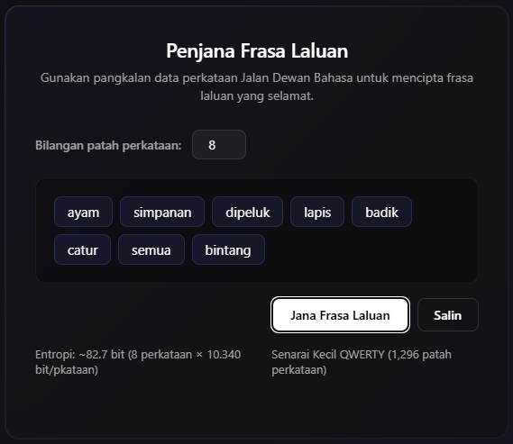
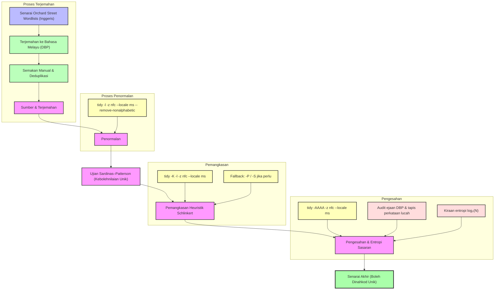

# Senarai Perkataan Jalan Dewan Bahasa

Senarai perkataan baharu untuk semua keperluan penciptaan frasa laluan anda. Gunakan senarai perkataan ini untuk mencipta frasa laluan yang kukuh dan selamat, sama ada [dengan dadu](https://www.eff.org/dice) atau penjana kata laluan yang terbina dalam sesetengah pengurus kata laluan.

* Terdiri daripada perkataan lazim yang ditemui dalam Wikipedia bahasa Melayu dan sumber bahasa Melayu Malaysia
* **Boleh dinyahkod secara unik**, maka selamat untuk menggabungkan perkataan dalam frasa laluan tanpa pembatas
* Bebas daripada perkataan lucah, singkatan, dan ejaan Indonesia
* Tersedia dalam pelbagai saiz untuk kegunaan yang berbeza

NOTA: Senarai ini disunting dari semasa ke semasa. Jika anda mahukan salinan statik yang tidak berubah bagi mana-mana senarai perkataan, sila muat turun senarai tersebut sebagaimana adanya sekarang, muat turun tag atau keluaran terkini, atau fork repositori ini pada bila-bila masa. Lihat maklumat pelesenan di bawah.

## Penjana Frasa Laluan Dalam Talian



Gunakan [Penjana Frasa Laluan Jalan Dewan Bahasa](https://C-Fu.github.io/jalan-dewan-bahasa-wordlists/html/index.html) — penjana dalam pelayar yang memuatkan pangkalan data SQLite secara langsung menggunakan sql.js (WebAssembly), tanpa pelayan atau pemasangan.

Anda juga boleh menggunakan [StrongPhrase.net](https://strongphrase.net/#/more) untuk menjana frasa laluan daripada Senarai Besar dan Senarai QWERTY. [Kod sumber tersedia di GitLab](https://gitlab.com/strongphrase/StrongPhrase.net).

## Cara Senarai Ini Dihasilkan

Setiap senarai perkataan dalam projek ini melalui saluran paip (pipeline) yang sama untuk memastikan kualiti, kebolehnilaian unik, dan kesesuaian untuk penciptaan frasa laluan.



### 1. Sumber dan Terjemahan

Senarai sumber bahasa Inggeris diambil daripada projek [Orchard Street Wordlists](https://github.com/sts10/orchard-street-wordlists), yang mengandungi senarai perkataan bahasa Inggeris yang telah dibuktikan boleh dinyahkod secara unik.

Setiap patah perkataan bahasa Inggeris diterjemahkan ke dalam Bahasa Melayu Standard (ejaan Dewan Bahasa dan Pustaka, DBP). Terjemahan dilakukan menggunakan model bahasa besar (DeepSeek v4 Pro) dengan panduan ketat: satu perkataan sahaja, tiada frasa atau ruang, ejaan DBP (cth: *universiti* bukan *universitas*, *kualiti* bukan *kualitas*), dan mengelakkan perkataan lucah atau sensitif dari segi budaya. Selepas terjemahan automatik, perkataan disemak secara manual dalam kelompok-kelompok kecil.

Memandangkan pemetaan banyak-ke-satu (cth: "big" dan "large" kedua-duanya → *besar*) adalah lazim dalam terjemahan, deduplikasi dilakukan pada peringkat seterusnya. Jika bilangan perkataan unik selepas deduplikasi dan pemangkasan kurang daripada sasaran, perkataan Melayu tambahan daripada korpus DBP dan perbendaharaan kata lazim ditambah dalam pusingan suplementasi sehingga sasaran tercapai.

### 2. Penormalan

Perkataan mentah yang diterjemahkan dinormalkan menggunakan alat [Tidy](https://github.com/sts10/tidy):

```bash
tidy -l -z nfc --locale ms --remove-nonalphabetic
```

Proses ini:
- Menukar semua aksara kepada huruf kecil (*lowercase*)
- Menormalkan pengekodan Unicode kepada bentuk NFC (Normalization Form C)
- Membuang semua aksara bukan abjad (angka, tanda baca, ruang, dll.)
- Menyusun perkataan mengikut turutan abjad dengan lokaliti bahasa Melayu (`--locale ms`)

### 3. Sifat Sardinas–Patterson dan Kebolehnilaian Unik

Suatu set perkataan **boleh dinyahkod secara unik** (*uniquely decodable*) jika setiap penjujukan perkataan daripada set tersebut hanya boleh dihuraikan dengan satu cara sahaja, tanpa sebarang kemungkinan yang lain.

Secara formal, sifat ini dinamakan sempena **Sardinas dan Patterson** (1953), yang membuktikan bahawa suatu kod adalah boleh dinyahkod secara unik jika dan hanya jika tiada dua jujukan perkataan yang berbeza menghasilkan rentetan aksara yang sama. Dalam konteks frasa laluan: jika senarai perkataan anda gagal memenuhi sifat ini, frasa laluan seperti `bukuharian` boleh dihuraikan sebagai `buku + harian` ATAU `bukuh + arian` — penyerang hanya perlu mencari SATU huraian yang sah untuk memecahkan frasa laluan anda.

**Mengapa ini penting untuk bahasa Melayu:** Bahasa Melayu ialah bahasa **aglutinatif** — ia mempunyai sistem imbuhan awalan yang sangat produktif (*meN-*, *ber-*, *ter-*, *di-*, *ke-*, *peN-*, *se-*) yang mencipta hubungan awalan baharu antara perkataan yang tidak wujud dalam bahasa Inggeris. Contohnya, selepas terjemahan:

| Perkataan Akar | Menjadi Awalan Bagi... |
|---|---|
| *ajar* | belajar, pelajar, pengajaran, diajar, pembelajaran |
| *makan* | makanan, pemakan, memakan, dimakan, termakan |
| *buku* | buku-buku, perbukuan, membukukan |
| *bersih* | membersihkan, kebersihan, pembersih, pembersihan |

Walaupun senarai bahasa Inggeris asal telah dibuktikan boleh dinyahkod secara unik, terjemahan terus ke bahasa Melayu **hampir pasti** akan memusnahkan sifat tersebut kerana hubungan imbuhan yang sama sekali berbeza. Oleh itu, setiap senarai yang diterjemahkan MESTI melalui proses pemangkasan semula.

### 4. Pemangkasan Heuristik Schlinkert

Untuk memulihkan kebolehnilaian unik, kami menggunakan **algoritma pemangkasan heuristik Schlinkert** melalui arahan `tidy -K`:

```bash
tidy -K -l -z nfc --locale ms
```

Algoritma ini berfungsi secara **tamak** (*greedy*): ia memeriksa setiap perkataan dalam senarai, dan jika mengalih keluar perkataan tersebut akan memulihkan sifat Sardinas–Patterson untuk perkataan-perkataan yang tinggal, perkataan itu akan dipangkas. Proses ini diulang sehingga tiada lagi perkataan yang boleh dialih keluar — senarai yang tinggal dijamin boleh dinyahkod secara unik.

**Mengapa tamak?** Masalah mencari subset maksimum yang boleh dinyahkod secara unik adalah NP-lengkap. Heuristik Schlinkert memberikan penyelesaian yang hampir optimum dalam masa yang munasabah, walaupun ia mungkin tidak mengekalkan subset terbesar yang mungkin. Untuk bahasa Melayu, kami mendapati pendekatan ini amat berkesan; pemangkasan biasanya membuang kurang daripada 5% perkataan selepas deduplikasi.

**Penyesuaian untuk ortografi Melayu:** Algoritma Schlinkert adalah agnostik bahasa (ia hanya beroperasi pada rentetan aksara), menjadikannya sesuai untuk bahasa Melayu. Walau bagaimanapun, parameter `--locale ms` memastikan penyusunan mengikut susunan abjad Rumi bahasa Melayu yang betul, dan penormalan NFC mengendalikan sebarang variasi pengekodan Unicode dalam korpus Melayu.

Jika pemangkasan `-K` (lalai) mengalih keluar terlalu banyak perkataan, mod alternatif `-P` dan `-S` tersedia sebagai fallback — setiap mod menggunakan strategi tamak yang sedikit berbeza untuk mengekalkan lebih banyak perkataan sementara masih menjamin kebolehnilaian unik.

### 5. Pengesahan dan Entropi Sasaran

Setiap senarai melalui pengesahan akhir menggunakan semua ujian Tidy:

```bash
tidy -AAAA -z nfc --locale ms
```

Ini mengesahkan:
- **Kebolehnilaian unik:** `Uniquely decodable? : true`
- **Bilangan perkataan:** Mencapai sasaran tepat (1,296 / 7,776 / 8,192 / 17,576)
- **Entropi per perkataan:** log₂(N) bit, di mana N ialah saiz senarai
- **Atas garis daya kekerasan:** Senarai cukup panjang untuk menentang serangan kekerasan
- **Bebas perkataan lucah:** Disaring terhadap senarai tolak perkataan lucah bahasa Melayu (33 entri)
- **Audit ejaan DBP:** Sifar pelanggaran ortografi Indonesia (tiada *-itas*, *karena*, *universitas*, dll.)

### Sasaran Entropi

Setiap saiz senarai menyediakan tahap entropi yang berbeza bagi setiap perkataan:

| Senarai | Saiz | Formula | Entropi |
|---------|------|---------|---------|
| Kecil | 1,296 | 6⁴ = 1,296 | 10.340 bit |
| Sederhana | 8,192 | 2¹³ = 8,192 | 13.000 bit |
| Dadu | 7,776 | 6⁵ = 7,776 | 12.925 bit |
| Besar | 17,576 | 26³ = 17,576 | 14.101 bit |

Frasa laluan 7 patah perkataan daripada Senarai Besar memberikan hampir 99 bit entropi — mencukupi untuk menentang serangan kekerasan dalam apa jua jangka masa yang munasabah.

## Senarai Besar Jalan Dewan Bahasa

[Senarai Besar Jalan Dewan Bahasa](lists/jalan-dewan-bahasa-besar.txt) ialah senarai 17,576 patah perkataan. Ia memberikan 14.1 bit entropi bagi setiap perkataan, bermakna frasa laluan 7 patah perkataan memberikan hampir 99 bit entropi.

```text
Panjang senarai             : 17576 patah perkataan
Purata panjang perkataan    : 7.48 aksara
Panjang perkataan terpendek : 3 aksara (aim)
Panjang perkataan terpanjang: 16 aksara (professionalisme)
Bebas perkataan awalan?     : false
Boleh dinyahkod secara unik?: true
Entropi per perkataan       : 14.101 bit
Kecekapan per aksara        : 1.885 bit
Atas garis daya kekerasan?  : true
Purata jarak suntingan      : 7.434

Contoh perkataan
----------------
ababil abad abadi abaii abaikan
abandon abandonmen abatemen abbey abbot
abbreviasi abbreviat abdas abdii abdikan
abdomen abdominal abducsi abduct aberrasi
abid abide abjadi abjadkan abnormal
```

## Senarai Sederhana Jalan Dewan Bahasa

[Senarai Sederhana Jalan Dewan Bahasa](lists/jalan-dewan-bahasa-sederhana.txt) mempunyai 8,192 (2<sup>13</sup>) patah perkataan. Saiz ini dioptimumkan untuk komputer perduaan dan penjana nombor rawaknya. Ia memberikan 13.00 bit entropi yang bulat bagi setiap perkataan, memudahkan pengiraan entropi untuk kita manusia.

```text
Panjang senarai             : 8192 patah perkataan
Purata panjang perkataan    : 7.07 aksara
Panjang perkataan terpendek : 3 aksara (ada)
Panjang perkataan terpanjang: 10 aksara (seumpamanya)
Bebas perkataan awalan?     : false
Boleh dinyahkod secara unik?: true
Entropi per perkataan       : 13.000 bit
Kecekapan per aksara        : 1.839 bit
Atas garis daya kekerasan?  : true
Purata jarak suntingan      : 6.966

Contoh perkataan
----------------
membaca menulis bekerja pelajar makanan mendapatkan
membantu berjalan mencari memberi menjadi merangkumi
keluarga pendidikan pengajaran pemberian pertanian pengambilan
pakaian perkakas peralatan perbuatan pergerakan pengawasan
kemasukan penjagaan pertolongan rawatan simpanan sokongan
```

Senarai ini [digunakan](https://github.com/buttercup/buttercup-generator/pull/18) oleh [pengurus kata laluan Buttercup](https://buttercup.pw/).

## Senarai Dadu Jalan Dewan Bahasa

[Senarai Dadu Jalan Dewan Bahasa](lists/jalan-dewan-bahasa-dadu.txt) ialah versi kami bagi senarai Dadu klasik. Dengan senarai ini, anda boleh [menggunakan dadu untuk mencipta frasa laluan yang selamat](https://www.eff.org/dice). 7,776 patah perkataan dalam senarai ini memberikan 12.925 bit entropi bagi setiap perkataan, sama seperti [senarai panjang EFF](https://www.eff.org/deeplinks/2016/07/new-wordlists-random-passphrases).

Senarai ini juga tersedia [tanpa nombor lontaran dadu yang didahulukan](lists/jalan-dewan-bahasa-dadu-bersih.txt).

```text
Panjang senarai             : 7776 patah perkataan
Purata panjang perkataan    : 7.05 aksara
Panjang perkataan terpendek : 3 aksara (ada)
Panjang perkataan terpanjang: 10 aksara (seumpamanya)
Bebas perkataan awalan?     : false
Boleh dinyahkod secara unik?: true
Entropi per perkataan       : 12.925 bit
Kecekapan per aksara        : 1.832 bit
Atas garis daya kekerasan?  : true
Purata jarak suntingan      : 6.954

Contoh perkataan
----------------
percaya lukisan penyokong mekanisme hamba panel
penceramah institut galakan membantu perayau suntikan
diperiksa golongan tiga belas pengeposan frigat mayonis
dipantau pembaris min pembaharuan cecair memerlukan
digilap jantung kecederaan cabaran kesepaduan kaki
```

Senarai ini ialah [satu pilihan](https://github.com/strongbox-password-safe/Strongbox/blob/master/resources/wordlists/orchard-street-medium.txt) untuk pengguna [pengurus kata laluan Strongbox](https://strongboxsafe.com/).

## Senarai Kecil Jalan Dewan Bahasa

[Senarai Kecil Abjad Jalan Dewan Bahasa](lists/jalan-dewan-bahasa-kecil-alpha.txt) dan [Senarai Kecil QWERTY Jalan Dewan Bahasa](lists/jalan-dewan-bahasa-kecil-qwerty.txt) kedua-duanya mempunyai 1,296 patah perkataan dan dioptimumkan untuk memasukkan frasa laluan ke dalam peranti seperti televisyen pintar atau konsol permainan video. Setiap perkataan memberikan tambahan 10.34 bit entropi kepada frasa laluan.

Perbezaan antara kedua-dua senarai ini ialah **susun atur papan kekunci** yang dioptimumkan. Gunakan senarai Abjad jika papan kekunci peranti anda disusun mengikut abjad; gunakan senarai QWERTY jika ia lebih hampir kepada [susun atur QWERTY](https://en.wikipedia.org/wiki/QWERTY).

### Senarai Kecil Abjad Jalan Dewan Bahasa
```text
Panjang senarai             : 1296 patah perkataan
Purata panjang perkataan    : 4.12 aksara
Panjang perkataan terpendek : 3 aksara (ada)
Panjang perkataan terpanjang: 7 aksara (hentikan)
Bebas perkataan awalan?     : false
Boleh dinyahkod secara unik?: true
Entropi per perkataan       : 10.340 bit
Kecekapan per aksara        : 2.509 bit
Atas garis daya kekerasan?  : true
Purata jarak suntingan      : 4.043

Contoh perkataan
----------------
abdi abjad adil agar bakal bahu baru
bantu bekal besar bumi cuba cuci curah
daki dalam dapat debu ekor elak enak
fikir gajah garam hadam hakis halus
ikut ikan inti jadi jaga jamu kaki
```

### Senarai Kecil QWERTY Jalan Dewan Bahasa
```text
Panjang senarai             : 1296 patah perkataan
Purata panjang perkataan    : 4.24 aksara
Panjang perkataan terpendek : 3 aksara (ada)
Panjang perkataan terpanjang: 8 aksara (dirujukkan)
Bebas perkataan awalan?     : false
Boleh dinyahkod secara unik?: true
Entropi per perkataan       : 10.340 bit
Kecekapan per aksara        : 2.441 bit
Atas garis daya kekerasan?  : true
Purata jarak suntingan      : 4.170

Contoh perkataan
----------------
akses akta alih aman amuk aneh akan
baris baru batu beku beras bina buku
catu cuba cuci culik curam curah dadih
dagu daki dapat deras didih dunia duri
ekor elak emas enak faham fajar fitnah
```

Kedua-dua senarai kecil ini juga tersedia dengan awalan nombor lontaran dadu: [Senarai Kecil Abjad dengan Dadu](lists/jalan-dewan-bahasa-kecil-alpha-dadu.txt) dan [Senarai Kecil QWERTY dengan Dadu](lists/jalan-dewan-bahasa-kecil-qwerty-dadu.txt). Formatnya menggunakan nombor lontaran dadu 4 digit yang dipisahkan dengan tab, contohnya: `1111\tabdi`.

Untuk maklumat lanjut tentang senarai kecil ini dan kes-kes penggunaannya, lihat [repositori GitHub ini](https://github.com/sts10/remote-words) dan/atau [catatan blog ini](https://sts10.github.io/2022/10/24/a-good-netflix-password.html).

## Pangkalan Data SQLite

Versi pangkalan data SQLite bagi semua senarai perkataan tersedia dalam direktori `db/`. Fail-fail ini boleh digunakan oleh aplikasi yang memerlukan carian perkataan yang lebih pantas atau integrasi pangkalan data.

## Soalan Lazim

Lihat [Soalan Lazim kami](FAQ.md) untuk jawapan kepada soalan-soalan lazim.

## Pelesenan

<a rel="license" href="http://creativecommons.org/licenses/by-sa/4.0/"></a><br />Karya ini dilesenkan di bawah <a rel="license" href="http://creativecommons.org/licenses/by-sa/4.0/">Lesen Antarabangsa Creative Commons Attribution-ShareAlike 4.0</a>.

### Sumber perkataan dan nota perundangan lain

Perkataan yang terkandung dalam senarai perkataan ini diterjemahkan daripada sumber bahasa Inggeris yang diambil daripada dua sumber: [data Google Books Ngram](https://storage.googleapis.com/books/ngrams/books/datasetsv3.html) (data 2012) dan Wikipedia, melalui [projek kekerapan perkataan Wikipedia](https://github.com/IlyaSemenov/wikipedia-word-frequency/), yang diambil pada Jun 2023. Terjemahan dilakukan ke dalam Bahasa Melayu Standard (Malaysia, ejaan DBP).

Projek ini tiada kaitan dengan Google, Wikipedia, mahupun pencipta projek kekerapan Wikipedia yang disebut di atas. Sepanjang pengetahuan kami, Google, Wikipedia, mahupun pencipta projek kekerapan perkataan Wikipedia yang disebut di atas tidak menyokong projek ini.

Pada masa perkataan diambil daripada Wikipedia, [teks Wikipedia dilesenkan di bawah](https://foundation.wikimedia.org/wiki/Policy:Terms_of_Use#7._Licensing_of_Content) [Lesen Antarabangsa Creative Commons Attribution-ShareAlike 4.0 ("CC BY-SA 4.0")](https://creativecommons.org/licenses/by-sa/4.0/), dan oleh itu kami menggunakan lesen yang sama untuk projek ini.
