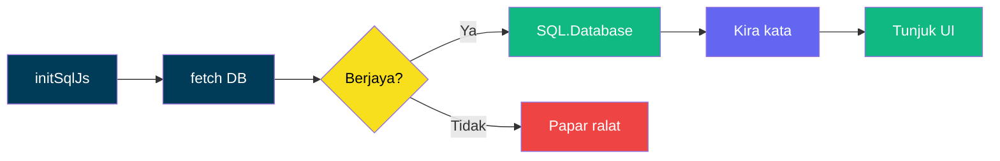
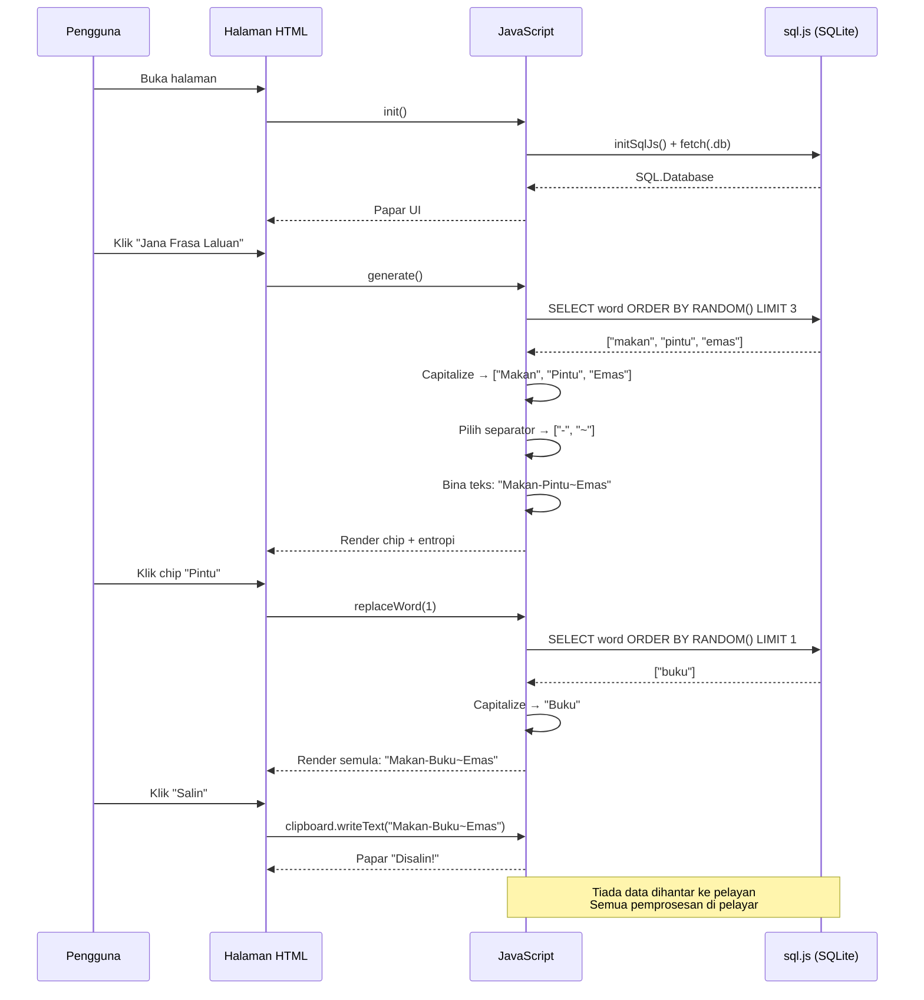

# Penjana Frasa Laluan — Analisis Teknikal

Dokumen ini menganalisis `html/index.html` — penjana frasa laluan Bahasa Melayu dalam pelayar yang menggunakan sql.js (WebAssembly SQLite) untuk memuatkan pangkalan data perkataan Jalan Dewan Bahasa.

## Gambaran Keseluruhan


## Senarai Teknologi

| Teknologi | Versi | Tujuan |
|-----------|-------|--------|
| **HTML5** | — | Struktur halaman, semantik, meta viewport |
| **CSS3** | — | Reka bentuk gelap (dark mode), grid, animasi, kaca (glassmorphism) |
| **JavaScript (ES6+)** | — | Logik penjanaan frasa, DOM manipulation, async/await |
| **sql.js** | 1.10 | WebAssembly SQLite — memproses pangkalan data tanpa pelayan |
| **SQLite** | (terbina dalam sql.js) | Pangkalan data perkataan 1,296 patah perkataan |
| **Clipboard API** | — | `navigator.clipboard.writeText()` untuk salin ke papan klip |
| **CDN (jsDelivr)** | — | Penghantaran sql.js WebAssembly |

**Zero dependencies:** Tiada npm, tiada bundler, tiada framework. Satu fail HTML, satu CDN.

## Seni Bina Aplikasi

```mermaid
flowchart TD
    subgraph Init["Fasa Permulaan (init)"]
        A[Muat sql.js WebAssembly] --> B[Fetch ../db/*.db]
        B --> C[Cipta SQL.Database]
        C --> D[Kira jumlah perkataan]
        D --> E[Sembunyi loading, tunjuk app]
    end

    subgraph Generate["Penjanaan Frasa"]
        F[Jana: Baca input wordCount] --> G[SQL: ORDER BY RANDOM() LIMIT N]
        G --> H[Capitalize huruf pertama]
        H --> I[Pilih separator rawak]
        I --> J[Render chip + bina teks salin]
        J --> K[Kira & papar entropi]
    end

    subgraph Interact["Interaksi Pengguna"]
        L[Klik chip perkataan] --> M[SQL: RANDOM() LIMIT 1]
        M --> N[Ganti perkataan, render semula]
        O[Klik Salin] --> P[Clipboard API: writeText]
    end

    Init --> Generate
    Generate --> Interact

    style A fill:#003b57,color:#fff
    style B fill:#003b57,color:#fff
    style C fill:#003b57,color:#fff
    style D fill:#003b57,color:#fff
    style E fill:#10B981,color:#fff
    style F fill:#f7df1e,color:#000
    style G fill:#6366F1,color:#fff
    style H fill:#6366F1,color:#fff
    style I fill:#6366F1,color:#fff
    style J fill:#6366F1,color:#fff
    style K fill:#10B981,color:#fff
    style L fill:#f7df1e,color:#000
    style M fill:#6366F1,color:#fff
    style N fill:#6366F1,color:#fff
    style O fill:#f7df1e,color:#000
    style P fill:#10B981,color:#fff
```

## Fungsi Teras

### `init()`


Fungsi async yang memulakan enjin sql.js, memuatkan pangkalan data SQLite melalui HTTP `fetch()`, dan mencipta pangkalan data dalam memori. Jika berjaya, elemen loading disembunyikan dan UI penjana dipaparkan.

| Langkah | Penerangan |
|---------|------------|
| `initSqlJs()` | Inisialisasi WebAssembly SQLite (~1MB .wasm dari CDN) |
| `fetch()` | Muat `jalan-dewan-bahasa-kecil-qwerty.db` (8 KB) sebagai ArrayBuffer |
| `SQL.Database()` | Cipta pangkalan data SQLite dalam memori dari buffer |
| `SELECT COUNT(*)` | Dapatkan jumlah perkataan sebenar untuk pengiraan entropi |

### `getWords(n)`
```sql
SELECT word FROM words ORDER BY RANDOM() LIMIT n
```

Mengembalikan `n` perkataan rawak daripada pangkalan data. `ORDER BY RANDOM()` menggunakan fungsi SQLite — setiap panggilan menghasilkan susunan rawak yang berbeza. Kata-kata kemudiannya di-hurufbesarkan (capitalize) pada aksara pertama.

| Aspek | Analisis |
|-------|----------|
| **Keselamatan** | `LIMIT n` menggunakan parameter integer yang telah divalidasi (3–12) — tiada risiko SQL injection |
| **Prestasi** | `ORDER BY RANDOM()` adalah O(n log n) untuk jadual 1,296 baris — tidak ketara |
| **Kelemahan** | Boleh mengembalikan perkataan yang sama dalam satu frasa (tiada `DISTINCT`). Ini adalah sengaja — perkataan berulang dibenarkan dalam frasa laluan |

### `generate()`
Fungsi utama yang:
1. Membaca dan mengesahkan input bilangan perkataan (3–12)
2. Memanggil `getWords(n)` untuk mendapatkan perkataan rawak
3. Memilih separator rawak untuk setiap celah antara perkataan
4. Membina rentetan `currentPassphraseText` (untuk disalin)
5. Memanggil `renderPassphrase()` untuk memaparkan chip perkataan
6. Memanggil `updateEntropy()` untuk mengemas kini paparan entropi

### `replaceWord(index)`
Membenarkan pengguna mengklik mana-mana chip perkataan untuk menggantikannya dengan perkataan rawak yang baharu:

```mermaid
flowchart LR
    A[Klik chip] --> B[Dapat index]
    B --> C[SQL: RANDOM LIMIT 1]
    C --> D[Capitalize]
    D --> E[Kemas kini currentWords]
    E --> F[Bina semula teks salin]
    F --> G[Render semula]

    style A fill:#f7df1e,color:#000
    style B fill:#6366F1,color:#fff
    style C fill:#003b57,color:#fff
    style D fill:#6366F1,color:#fff
    style E fill:#6366F1,color:#fff
    style F fill:#6366F1,color:#fff
    style G fill:#10B981,color:#fff
```



### Salin ke Papan Klip

```javascript
navigator.clipboard.writeText(currentPassphraseText)
```

Menggunakan Async Clipboard API. Kandungan yang disalin termasuk separator (cth: `Beli-Pintu-Emas-Jadi`). Jika gagal (biasanya dalam konteks HTTP biasa tanpa HTTPS), mesej ralat dipaparkan.

### `updateEntropy(wordCount)`
```javascript
entropy = log2(totalWords) * wordCount
// = 10.340 * 6 = ~62.0 bit
```

Mengira dan memaparkan jumlah entropi frasa laluan berdasarkan teorem maklumat Shannon.

## Reka Bentuk Visual

### Sistem Reka Bentuk (DESIGN.md)

```mermaid
flowchart TD
    subgraph Warna["Palet Warna"]
        P1[Utama: #6366F1 Indigo]:::primary
        P2[Teks Utama: #FFFFFF]:::text
        P3[Teks Kedua: #A3A3A3]:::text2
        P4[Kad: #101015]:::surface
    end

    subgraph Komponen["Komponen UI"]
        C1[Shell Gradien<br/>1px padding<br/>16px radius]:::shell
        C2[Kad Kaca<br/>backdrop-filter blur<br/>15px radius]:::glass
        C3[Chip Perkataan<br/>rgba(99,102,241,0.1)<br/>klik untuk ganti]:::chip
        C4[Butang Utama<br/>#FFFFFF bg<br/>#000000 teks]:::btn
    end

    Warna --> Komponen

    classDef primary fill:#6366F1,color:#fff
    classDef text fill:#fff,color:#000
    classDef text2 fill:#a3a3a3,color:#000
    classDef surface fill:#101015,color:#fff
    classDef shell fill:linear-gradient(135deg,rgba(99,102,241,0.3),transparent),color:#fff
    classDef glass fill:rgba(16,16,21,0.85),color:#fff,stroke:rgba(255,255,255,0.05)
    classDef chip fill:rgba(99,102,241,0.1),color:#fff,stroke:#6366F1
    classDef btn fill:#fff,color:#000
```

| Elemen | Gaya |
|--------|------|
| **Latar belakang** | `linear-gradient(135deg, #0a0a0f → #101015 → #1a1a2e)` |
| **Shell gradien** | `1px` padding dengan `linear-gradient(135deg, rgba(99,102,241,0.3), transparent)` |
| **Kad kaca** | `background: rgba(16,16,21,0.85)`, `backdrop-filter: blur(24px)`, `border-radius: 15px` |
| **Chip perkataan** | `background: rgba(99,102,241,0.1)`, `border: 1px solid rgba(99,102,241,0.25)`, `border-radius: 8px`, kursor pointer |
| **Butang utama** | `background: #FFFFFF`, `color: #000000`, `border-radius: 8px` |
| **Separator** | `color: #6366F1`, `opacity: 0.6`, aksara papan kekunci: `- _ ~ . \| : +` |

### Responsif

Pada skrin < 500px:
- Butang Jana menjadi lebar penuh
- Layout kawalan bertukar kepada menegak (flex-direction: column)
- Padding kad dikurangkan kepada 20px
- Saiz fon tajuk dikurangkan kepada 22px

## Model Data

### State (Keadaan Aplikasi)

| Pembolehubah | Jenis | Tujuan |
|-------------|-------|--------|
| `db` | `SQL.Database` | Instance pangkalan data SQLite |
| `totalWords` | `Number` | Jumlah perkataan dalam pangkalan data |
| `currentWords` | `String[]` | Array perkataan semasa dalam frasa |
| `currentSeparators` | `String[]` | Array separator antara perkataan |
| `currentPassphraseText` | `String` | Teks lengkap frasa untuk disalin |

### Skema Pangkalan Data (SQLite)

```sql
CREATE TABLE words (
    id INTEGER PRIMARY KEY AUTOINCREMENT,
    word TEXT NOT NULL UNIQUE,
    length INTEGER GENERATED ALWAYS AS (LENGTH(word)) STORED
);
```

1,296 baris. Lajur `word` menggunakan `UNIQUE` untuk indeks automatik.

## Aliran Data Frasa Laluan



## Keselamatan & Privasi

| Aspek | Status |
|-------|--------|
| **Pemprosesan pelayan** | ✅ Sifar — semua data diproses dalam pelayar |
| **Data dihantar** | ✅ Tiada — DB dimuatkan secara tempatan |
| **HTTPS diperlukan** | ⚠️ Untuk Clipboard API — fallback ke salinan manual |
| **CORS** | ✅ Same-origin fetch untuk .db |
| **SQL injection** | ✅ Parameter integer divalidasi (3–12); tiada input pengguna dalam query |
| **Kandungan wasm** | ✅ sql.js dari CDN jsDelivr (subresource integrity boleh ditambah) |

## Metrik Prestasi

| Metrik | Ukuran |
|--------|--------|
| **Saiz muat turun DB** | ~8 KB (jalan-dewan-bahasa-kecil-qwerty.db) |
| **Saiz sql.js wasm** | ~1 MB (dimuatkan sekali, dicache) |
| **Masa init** | ~200-500ms (bergantung kepada kelajuan internet) |
| **Masa penjanaan** | <5ms (query 1,296 baris dalam memori) |
| **Masa render** | <1ms (6 chip perkataan) |

## Ulasan Kod

### Kekuatan
- **Tiada framework** — satu fail HTML, mudah diselenggara dan dihos
- **Privasi tinggi** — tiada data keluar dari pelayar
- **UI responsif** — berfungsi pada desktop dan mudah alih
- **Kebolehcapaian** — chip perkataan boleh diklik, status dapat dilihat
- **Kod modular** — setiap fungsi mempunyai satu tanggungjawab

### Penambahbaikan Potensi
1. **Subresource Integrity** — Tambah atribut `integrity` pada skrip sql.js CDN untuk keselamatan
2. **Cache wasm** — Simpan .wasm dalam Cache API untuk muat semula luar talian
3. **Service Worker** — Benarkan penggunaan luar talian sepenuhnya
4. **Pemilihan berbilang senarai** — Benarkan pengguna memilih senarai perkataan lain
5. **Ujian unit** — Fungsi seperti `getWords`, `updateEntropy`, `randomSeparator` boleh diuji

## Cara Hos

Halaman ini sedia untuk dihos pada GitHub Pages:

```
https://C-Fu.github.io/jalan-dewan-bahasa-wordlists/html/index.html
```

Atau mana-mana pelayan HTTP statik:

```bash
python3 -m http.server
# http://localhost:8000/html/index.html
```

**Nota:** Mungkin tidak berfungsi melalui `file://` kerana sekatan CORS dan WebAssembly pada sesetengah pelayar.
